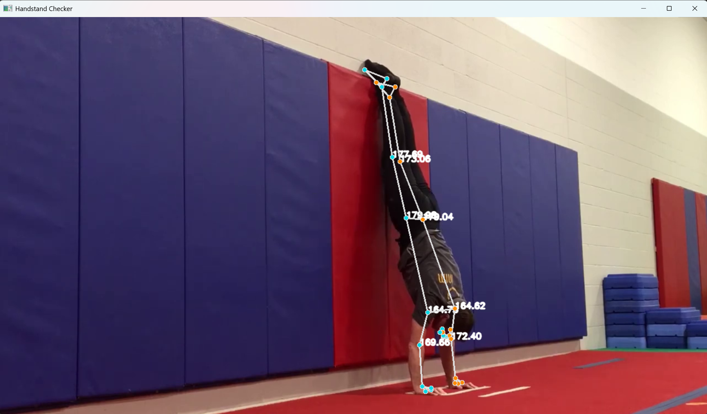

# handstand_pose



Minimalistic handstand pose checker using MediaPipe and OpenCV.

## Requirements

- Python 3.10+
- mediapipe
- opencv-python
- numpy
- pyttsx3

## Installation

Install dependencies:

```bash
pip install mediapipe opencv-python numpy pyttsx3
```

## Usage

### Webcam mode

```bash
python main.py
```

### Video file mode

```bash
python main.py --filepath /path/to/video.mp4
```

Press `q` to quit.
